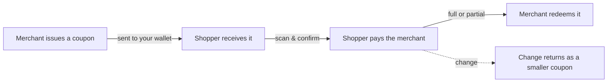

# Imani Wallet

A phone wallet for **coupons you can spend like cash** at the local businesses you
already visit: the market stall, the farm gate, the corner shop.

A merchant sells you a coupon (think of it as a gift card or an IOU for goods).
It lands in your wallet in seconds. Later you spend it back with that same
merchant, in full or in part, and your change comes back as a smaller coupon.
No bank account, no card reader, no app store sign-in with an email and password.

> **New here?** Jump to the guide for your side of the counter:
>
> - **[I'm a shopper](docs/customers.md)** — receive coupons and pay with them.
> - **[I sell things](docs/merchants.md)** — issue coupons and take payment.
> - **[How it actually works](docs/how-it-works.md)** — the ideas behind it, in plain terms.
> - **[The decentralised posture](docs/decentralised-posture.md)** — why there's no honeypot to raid.
> - **[For developers](#for-developers)** — run and build the app.

---

## Why this exists

Small sellers, especially at weekend markets and farm stalls, often sell
**coupons as IOUs** and redeem them later for goods. It helps them predict how
much they'll sell, and it gives regulars a reason to come back. But doing it on
paper is fiddly: paper coupons get lost, they're easy to forge, and nobody has a
running total.

Imani Wallet turns that coupon into something digital that:

- **arrives instantly**, even before the payment fully settles behind the scenes,
- **can't be copied or forged**, because each coupon is a one-of-a-kind digital token,
- **can be split**, so a €5 coupon can pay for a €2 purchase and hand you €3 back,
- **keeps its own history**, so both sides can see what was issued, spent, and is still valid.

You hold your own coupons. There's no company account in the middle holding your
balance for you. The value lives on your phone, and only you can spend it.

## The two sides

The same app serves everyone. You pick your side when you create your account,
and you can start selling later if you begin as a shopper.

| | **Shopper** | **Merchant** |
| --- | --- | --- |
| Home screen | Your coupons, grouped by the merchant who issued them | A till: **Sell** and **Redeem** |
| Main actions | **Scan** to pay, **Receive** to show your code | **Sell** a coupon, **Redeem** one back |
| Sees | Total balance, each merchant's coupons and history | Sales history, coupons issued, what's expiring, simple stats |

Everything else, the account, the profile, backing up your key, works the same
for both.

## How a coupon moves, at a glance



1. **Issue.** A merchant creates a coupon for a value (say €5) and sends it to a
   shopper's code. The shopper's phone shows a toast: *payment on its way*.
2. **Receive.** Seconds later the coupon settles and appears in the shopper's
   wallet, filed under that merchant.
3. **Pay.** The shopper scans the merchant's payment QR, confirms the amount, and
   the coupon (or part of it) goes back to the merchant.
4. **Change.** If the shopper paid less than the coupon was worth, the leftover
   returns as a new, smaller coupon.

The [how-it-works guide](docs/how-it-works.md) explains what a coupon really is,
why it can't be forged, and why your key matters so much.

## What you need

- A phone or a browser. The wallet runs on the web and as an Android app.
- A one-time setup: pick a handle (like `alice@imani.casa`) and a passphrase.
- **Your backup key.** This is the one thing you must keep safe. It is the only
  way to recover your coupons on a new phone, and nobody can reset it for you.
  The app shows it once, when you sign up. Write it down.

---

## For developers

This is a single-page web app (React 19 + TypeScript + Vite), packaged for
Android with Capacitor. It talks to the Imani gateway backend for identity,
Nostr message relay, and the Cashu mint that backs coupons with value.

### Run it

```bash
npm install
npm run dev        # dev server on :5173, proxies /api to the local gateway
```

The dev server also stands in for the production edge proxy (auth validation and
header injection), so a local gateway stack must be running for login and coupon
flows to work. See `deploy/` for the compose override and nginx config.

### Common tasks

```bash
npm run build      # type-check + production bundle
npm run preview    # serve the built bundle on :4173
npm run test       # vitest, once
npm run test:watch # vitest, watch mode
npm run lint       # eslint
npm run android    # build + sync the Capacitor Android project
```

### Layout

| Path | What's there |
| --- | --- |
| `src/pages/` | One file per screen (login, home, pay, receive, sell, redeem, settings) |
| `src/lib/` | The logic: wallet storage, receiving, paying, identity, profiles |
| `src/components/` | Shared UI, including the coupon **pass** rendering |
| `packages/` | Vendored `@imani/*` packages (wallet storage, dm-poll, vouchers, money) |
| `shared/` | Classic-script modules bridged from the original app (redemption, formatting) |
| `deploy/` | Docker compose override, nginx edge config, relay config |
| `scripts/` | Seeding and verification helpers for a local stack |

### Deeper design notes

Start with [`docs/how-it-works.md`](docs/how-it-works.md) for the concepts, and
[`docs/decentralised-posture.md`](docs/decentralised-posture.md) for why the
architecture is shaped the way it is.

The original design record was retired once the code became the authority. It is
still in git history (`docs/superpowers/specs/2026-08-11-farmer-coupon-wallet-design.md`,
last present at `e38ba27`) if the reasoning behind a specific decision is needed.

## License

MIT. Imani Wallet is open source.
