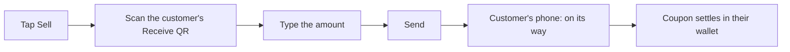

# Merchant's guide

Imani Wallet lets you **sell coupons** to your customers and **take them back as
payment** later. It's built for market stalls, farm gates, and small shops: sell
a coupon today, redeem it for goods tomorrow, and always know what you've issued
and what's still out there.

- [Why sell coupons](#why-sell-coupons)
- [Setting up your stall](#setting-up-your-stall)
- [Your till at a glance](#your-till-at-a-glance)
- [Selling a coupon](#selling-a-coupon)
- [Taking payment (Redeem)](#taking-payment-redeem)
- [History, stats, and what's expiring](#history-stats-and-whats-expiring)
- [Opening and closing your stall](#opening-and-closing-your-stall)
- [Keeping your account safe](#keeping-your-account-safe)
- [Common questions](#common-questions)

## Why sell coupons

Selling coupons up front is an old market trick with real benefits:

- **You know your sales sooner.** Money comes in when the coupon is bought, not
  only when goods leave the stall.
- **Regulars come back.** A coupon in a customer's wallet is a reason to return.
- **No card fees or card reader.** Customers pay you back from coupons they
  already hold, phone to phone.
- **No forgeries.** Every coupon is a unique digital token. It can't be copied,
  and once it's spent back to you it can't be spent again.

## Setting up your stall

1. Open the app and choose **Create an account**.
2. Turn on the **"I am a merchant"** switch during sign-up. (Already a shopper?
   You can start selling later, see [below](#opening-and-closing-your-stall).)
3. Fill in your **stall details**: business name, a short description, categories,
   and how long the coupons you issue stay valid.

   > **Choose validity carefully.** How long your coupons last is set once and
   > can't be changed afterwards. The app tells you this before you pick.
4. Pick a **passphrase** and **save your backup key** (the app shows it once,
   see [Keeping your account safe](#keeping-your-account-safe)).

Your business name and description are what customers see on the coupon card in
their wallet, so make them recognisable.

## Your till at a glance

A merchant's home screen is the **till**:

- **Sell** — issue a coupon to a customer.
- **Redeem** — take a coupon back as payment.
- Recent movements, with links to your full history.
- **Expiring soon** — coupons you've issued that are within a week of expiry (only
  shown when there are some).

**Stats** live in the account menu (top-right): coupons issued, value issued, how
many came back, and daily activity over the last 7, 30, or 90 days.

## Selling a coupon

1. Tap **Sell**.
2. Ask the customer to open **Receive** on their phone, then scan their QR code.
3. Type the **amount** in your currency.
4. Tap send. Hold on a moment while it completes: the coupon is created, backed
   with value, and delivered to the customer.
5. The customer's phone shows *"on its way"* immediately, and the coupon lands in
   their wallet a few seconds later.

Keep the customer there until it confirms. If a delivery fails, it's better to
know while they're still at the stall.

## Taking payment (Redeem)

When a customer pays you back with a coupon they hold from you:

1. Tap **Redeem**. The app creates a **payment request** and shows a QR code with
   the amount you're asking for.
2. The customer taps **Scan**, points at your QR, and confirms.
3. The coupon (or part of it) transfers to you. The screen updates from
   *"Waiting for payment"* to **paid** on its own.

You don't need to press anything to detect the payment: your till is already
listening, and the coupon arrives through the same channel any coupon does. If
the customer pays less than a whole coupon, they keep the change automatically.

## History, stats, and what's expiring

- **Transactions** lists every movement: coupons you issued and coupons that came
  back. Tap one to see its detail, and from there **View coupon**.
- **Coupons** lists what you've issued.
- **Expiring soon** on the till surfaces coupons about to lapse, soonest first, so
  you can nudge customers to spend them.
- **Stats** gives you the totals: issued, returned, and a simple day-by-day chart.

A note on honesty: these figures are **your device's own record** of what you've
issued and what's returned. The app tells you so on the Stats screen. Whether a
customer has spent a coupon you gave them isn't something you can see, it's value
in their wallet until it comes back to you.

If you sell in a currency without cents (like XAF or JPY), amounts show correctly
on your till and on your customer's screen.

## Opening and closing your stall

- **Open for business** is a switch in **Settings → your stall**. Turn it off when
  you stop trading, and your home screen goes back to the shopper view (Pay /
  Receive). Your settings and history stay put; turn it back on to sell again.
- **Starting to sell as a shopper:** go to **Settings → Start selling** and fill in
  your stall details. No new account, your coupons and identity come with you.

## Keeping your account safe

Everything in the [shopper's guide on safety](customers.md#keeping-your-account-safe)
applies to you too, and your history matters as much as your coupons:

- **Your backup key is the master key.** Shown once at sign-up. Write it down and
  keep it private. Anyone with it can act as your business.
- **Your sales history follows your key, not this phone.** It's stored securely on
  the network, encrypted to you. Log in on a new phone with your key and your
  stall, sales, and stats come back.
- **Download a backup file** from **Settings → Backup** as well. It's encrypted
  with your passphrase.
- **There is no password reset**, and **logging out wipes this device.** Only log
  out when you have your backup.

## Common questions

**Where does the value come from?**
Each coupon is backed with real value when you issue it, so it's worth what it
says. To you and your customer it just behaves like a coupon.

**Can a customer spend my coupon somewhere else?**
No. Coupons are tied to you. They can only be redeemed back with your stall.

**Can a coupon be spent twice?**
No. Once a coupon comes back to you it's used up. Partial payments leave the
customer a smaller coupon and take the rest, with no way to double-spend.

**A customer says their 2,500 coupon shows as 25.00.**
This was a display bug affecting currencies without cents (XAF, XOF, JPY), and
it's fixed. Amounts now show correctly on the customer's coupon screen, in their
notifications, and on your till. There is no longer any reason to prefer EUR or
USD over your own currency. If you still see a 100x-off figure anywhere, that's
worth reporting, as it's a bug rather than expected behaviour.

**Do I need a card reader or a merchant bank account?**
No. Everything happens phone to phone through the app.

---

Curious about what a coupon really is and why it's secure?
Read **[How it works](how-it-works.md)**.
